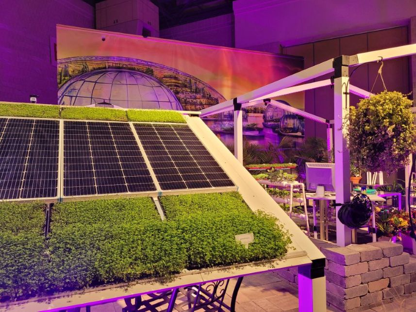

I am a physical chemist with expertise in ultrafast spectroscopy, materials synthesis, and machine learning for the development of molecules and materials for renewable energy and quantum information science. I recently completed postdoctoral research at Brookhaven National Laboratory, after earning my PhD in physical chemistry at Northwestern University. I completed my undergraduate degree in chemistry at Columbia University.

I am passionate about pursuing research that shapes a better and more sustainable world for our society. I am equally invested in working to make STEM research a more inclusive place, and I have mentored many students and researchers with intentionality and care to help them reach their goals.

I am open to research collaborations and offer tutoring and technical consultations (proposal writing, idea generation, school applications, etc). Feel free to [book](https://supercal.com/michelemyong) a short call with me to discuss my teaching and consultation offerings.

